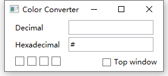
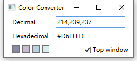

# color-converter

Convert colors between decimal and hexadecimal.

Make toning easier!!

## Usage

|  | |
| -------------------------------- | -------------------------------- |

- Use `,` as delimiter for decimal colors. It can convert characters expect `,` to `,`
- You can input two `,` at most, otherwise the content after the third `,` will be deleted
- Click `Decimal` or `Hexadecimal` to copy the corresponding color
- The small color block in the left lower corner records the history of color conversion
- Check `Top window` checkbox to top the window